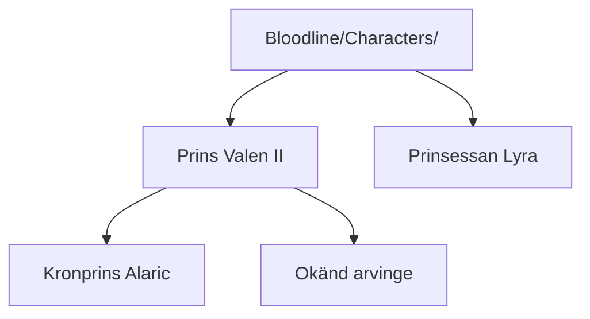

## 🏛️ De Rivièr
The De Rivièr family is a wealthy and influential wine-producing house from [[Liora]]. Their name is tied to refinement, trade, and old coastal prestige. Beneath the elegance of De Rivièr lies a family shaped by expectations, reputation, and quiet internal distance.

