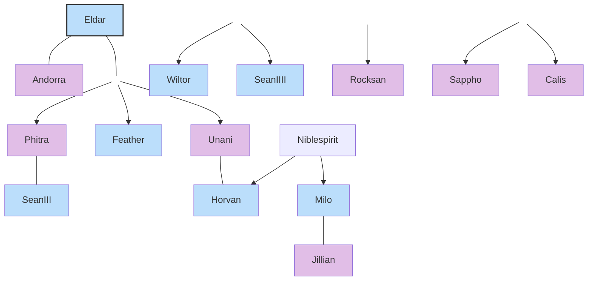

```mermaid
---

config:

  layout: fixed

---

flowchart TB

    Eldar["Eldar"] --- Andorra["Andorra"] & EmA[" "]

    EmA --> Phitra["Phitra"] & Feather["Feather"] & Unani["Unani"]

    Phitra --- SeanIII["SeanIII"]

    PmS[" "] --> Wiltor["Wiltor"] & SeanIIII["SeanIIII"]

    Unani --- Horvan["Horvan"]

    UmH[" "] --> Rocksan["Rocksan"]

    Niblespirit["Niblespirit"] --> Horvan & Milo["Milo"]

    Milo --- Jillian["Jillian"]

    MmJ[" "] --> Sappho["Sappho"] & Calis["Calis"]

  

    EmA@{ shape: text}

    PmS@{ shape: text}

    UmH@{ shape: text}

    MmJ@{ shape: text}

    style Eldar fill:#BBDEFB,stroke:#333,stroke-width:2px

    style Andorra fill:#E1BEE7

    style EmA stroke-width:0px,stroke-dasharray:0,fill:transparent

    style Phitra fill:#E1BEE7

    style Feather fill:#BBDEFB

    style Unani fill:#E1BEE7

    style SeanIII fill:#BBDEFB

    style PmS fill:transparent,stroke-width:0px,stroke-dasharray:0

    style Wiltor fill:#BBDEFB

    style SeanIIII fill:#BBDEFB

    style Horvan fill:#BBDEFB

    style Rocksan fill:#E1BEE7

    style Milo fill:#BBDEFB

    style Jillian fill:#E1BEE7

    style Sappho fill:#E1BEE7

    style Calis fill:#E1BEE7
```
