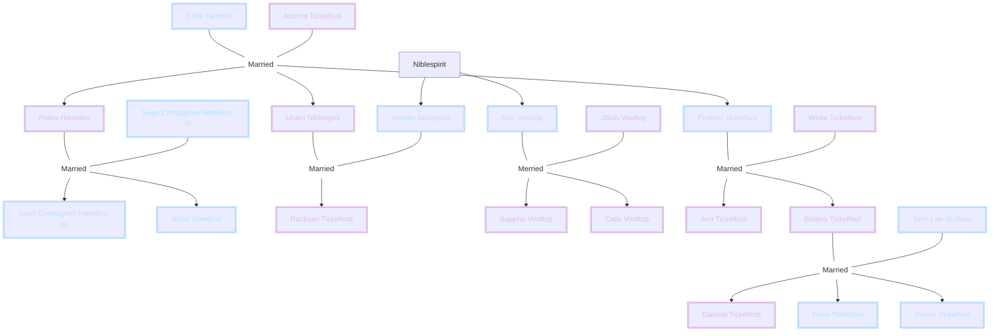

```mermaid
flowchart TB

    1["Eldar Tarrintel"] --- 1+2["Married"]

    2["Andora Tickelfoot"] --- 1+2

    1+2 --> 3["Phitra Hamilton"] & 7["Unani Niblespirit"] & 14["Feather Tickelfoot"]

    3 --- 3+4["Married"]

    4["Sean Christopher Hamilton III"] --- 3+4

    3+4 --> 5["Sean Christopher Hamilton IIII"] & 6["Wiltor Hamilton"]

    7 --- 7+8["Married"]

    8["Horvan Niblespirit"] --- 7+8

    7+8 --> 9["Rocksan Tickelfoot"]

    9+10["Niblespirit"] --> 8 & 10["Milo Vindtop"]

    10 --- 10+11["Merried"]

    11["Jillian Vindtop"] --- 10+11

    10+11 --> 12["Sappho Vindtop"] & 13["Calis Vindtop"]

    14 --- 14+15["Married"]

    15["Wiree Tickelfoot"] --- 14+15

    14+15 --> 16["Ann Tickelfoot"] & 17["Eldana Tickelfoot"]

    17 --- 17+18["Married"]

    18["Jami-Lee Wolfaxe"] --- 17+18

    17+18 --> 19["Daniela Tickelfoot"] & 20["Dave Tickelfoot"] & 21["Danny Tickelfoot"]

  

    1+2@{ shape: text}

    3+4@{ shape: text}

    7+8@{ shape: text}

    10+11@{ shape: text}

    14+15@{ shape: text}

    17+18@{ shape: text}

    style 1 stroke-width:4px,stroke-dasharray: 0,stroke:#BBDEFB,color:#BBDEFB

    style 2 stroke:#E1BEE7,stroke-width:4px,stroke-dasharray: 0,color:#E1BEE7

    style 3 color:#E1BEE7,stroke-width:4px,stroke-dasharray: 0,stroke:#E1BEE7

    style 7 color:#E1BEE7,stroke-width:4px,stroke-dasharray: 0,stroke:#E1BEE7

    style 14 stroke-width:4px,stroke-dasharray: 0,stroke:#BBDEFB,color:#BBDEFB

    style 4 color:#BBDEFB,stroke:#BBDEFB,stroke-width:4px,stroke-dasharray: 0

    style 5 color:#BBDEFB,stroke-width:4px,stroke-dasharray: 0,stroke:#BBDEFB

    style 6 color:#BBDEFB,stroke-width:4px,stroke-dasharray: 0,stroke:#BBDEFB

    style 8 stroke-width:4px,stroke-dasharray: 0,stroke:#BBDEFB,color:#BBDEFB

    style 9 color:#E1BEE7,stroke-width:4px,stroke-dasharray: 0,stroke:#E1BEE7

    style 10 stroke-width:4px,stroke-dasharray: 0,stroke:#BBDEFB,color:#BBDEFB

    style 11 color:#E1BEE7,stroke-width:4px,stroke-dasharray: 0,stroke:#E1BEE7

    style 12 color:#E1BEE7,stroke-width:4px,stroke-dasharray: 0,stroke:#E1BEE7

    style 13 color:#E1BEE7,stroke-width:4px,stroke-dasharray: 0,stroke:#E1BEE7

    style 15 stroke:#E1BEE7,stroke-width:4px,stroke-dasharray: 0,color:#E1BEE7

    style 16 color:#E1BEE7,stroke-width:4px,stroke-dasharray: 0,stroke:#E1BEE7

    style 17 color:#E1BEE7,stroke-width:4px,stroke-dasharray: 0,stroke:#E1BEE7

    style 18 color:#BBDEFB,stroke-width:4px,stroke-dasharray: 0,stroke:#BBDEFB

    style 19 stroke-width:4px,stroke-dasharray: 0,stroke:#E1BEE7,color:#E1BEE7

    style 20 color:#BBDEFB,stroke:#BBDEFB,stroke-width:4px,stroke-dasharray: 0

    style 21 color:#BBDEFB,stroke-width:4px,stroke-dasharray: 0,stroke:#BBDEFB
```
