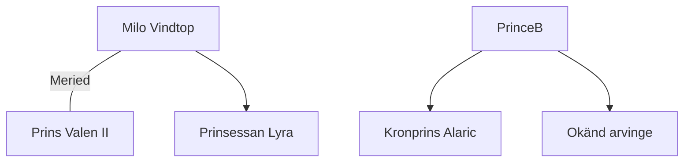

```mermaid
graph TD
    %% Familjekopplingar (förälder --> barn)
    Milo["Milo Vindtop"] ---|"Meried"| Jillian["Prins Valen II"]
    Milo --> PrincessC["Prinsessan Lyra"]
    
    PrinceB --> HeirD["Kronprins Alaric"]
    PrinceB --> SecretE["Okänd arvinge"]

    %% Klickbara länkar till andra sidor (byt ut till dina egna filnamn)
    click Milo "Bloodline/Characters/Milo Vindtop"
    click PrinceB "Prins-Valen-II"
    click PrincessC "Prinsessan-Lyra"
    click HeirD "Kronprins-Alaric"
    
```