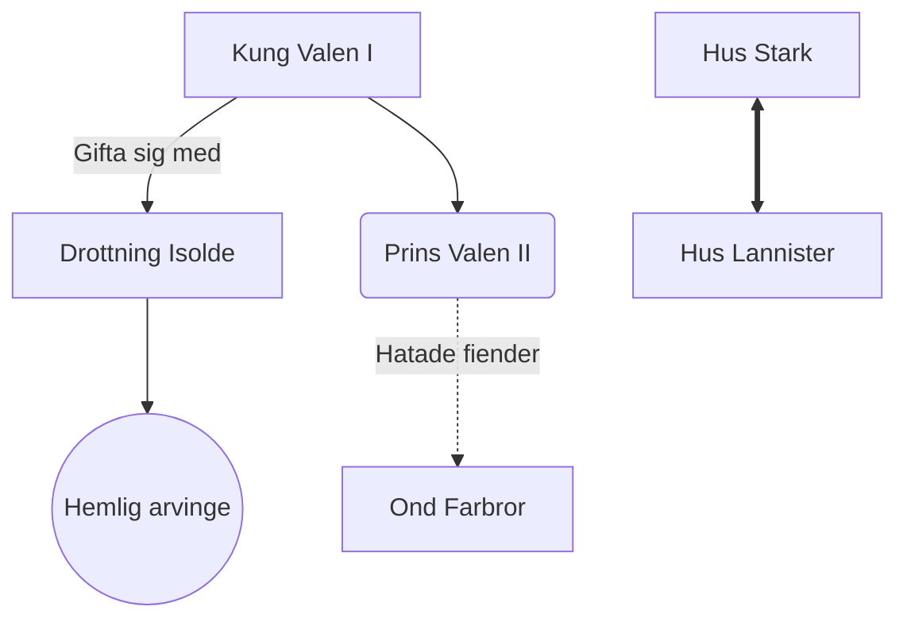

```mermaid
graph TD
    %% Olika former på boxar
    A["Kung Valen I"] -->|Gifta sig med| B["Drottning Isolde"]
    
    %% Cirkel (använd paranteser)
    B --> C((Hemlig arvinge))
    
    %% Rundad box (använd runda parenteser)
    A --> D(Prins Valen II)
    
    %% Streckad pil för rivalitet/annan koppling
    D -.->|Hatade fiender| E["Ond Farbror"]
    
    %% Dubbelriktad pil
    F["Hus Stark"] <==> G["Hus Lannister"]
```

