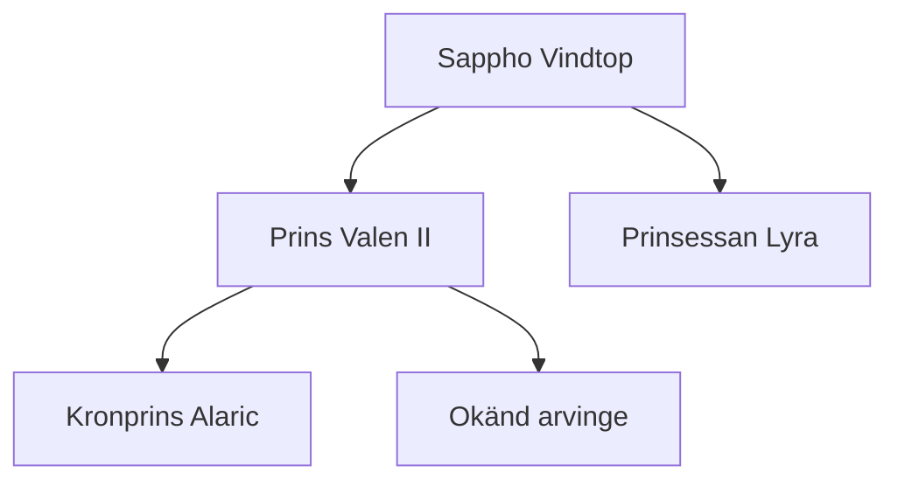

```mermaid
graph TD
    %% Familjekopplingar (förälder --> barn)
    KingA["Sappho Vindtop"] --> PrinceB["Prins Valen II"]
    KingA --> PrincessC["Prinsessan Lyra"]
    
    PrinceB --> HeirD["Kronprins Alaric"]
    PrinceB --> SecretE["Okänd arvinge"]

    %% Klickbara länkar till andra sidor (byt ut till dina egna filnamn)
    click KingA "Sappho Vindtop" "Gå till Kung Valen"
    click PrinceB "Prins-Valen-II" "Gå till Prins Valen"
    click PrincessC "Prinsessan-Lyra" "Gå till Prinsessan Lyra"
    click HeirD "Kronprins-Alaric" "Gå till Kronprins Alaric"
    
```
