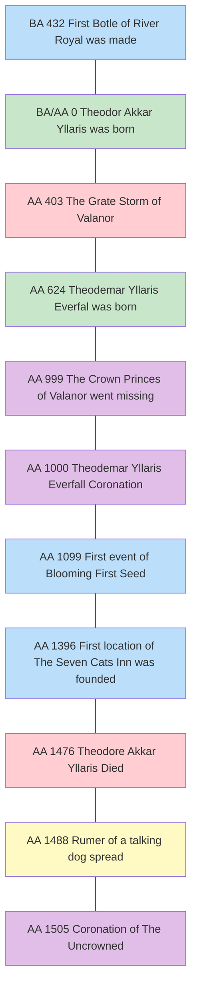

## 📜Overview 
This land of mine is called Valanor [[Theodore Akkar Yllaris]] named this new land after [[The Great Storm of Valanor]].

## 🕒 Timeline

```mermaid
flowchart TB

    BA432["BA 432 First Botle of River Royal was made"] --- BAAA0["BA/AA 0 Theodor Akkar Yllaris was born"]

    BAAA0 --- AA403["AA 403 The Grate Storm of Valanor"]

    AA403 --- AA624["AA 624 Theodemar Yllaris Everfal was born"]

    AA624 --- AA999["AA 999 The Crown Princes of Valanor went missing"]

    AA999 --- AA1000["AA 1000 Theodemar Yllaris Everfall Coronation"]

    AA1000 --- AA1099["AA 1099 First event of Blooming First Seed"]

    AA1099 --- AA1396["AA 1396 First location of The Seven Cats Inn was founded"]

    AA1396 --- AA1476["AA 1476 Theodore Akkar Yllaris Died"]

    AA1476 --- AA1488["AA 1488 Rumer of a talking dog spread"]

    AA1488 --- AA1505["AA 1505 Coronation of The Uncrowned"]


    style BA432 fill:#BBDEFB
    style BAAA0 fill:#C8E6C9
    style AA403 fill:#FFCDD2
    style AA624 fill:#C8E6C9
    style AA999 fill:#E1BEE7
    style AA1000 fill:#E1BEE7
    style AA1099 fill:#BBDEFB
    style AA1396 fill:#BBDEFB
    style AA1476 fill:#FFCDD2
    style AA1488 fill:#FFF9C4
    style AA1505 fill:#E1BEE7
    
    click BA432 href "World/Locations/Venues/River-Royal"
```

---